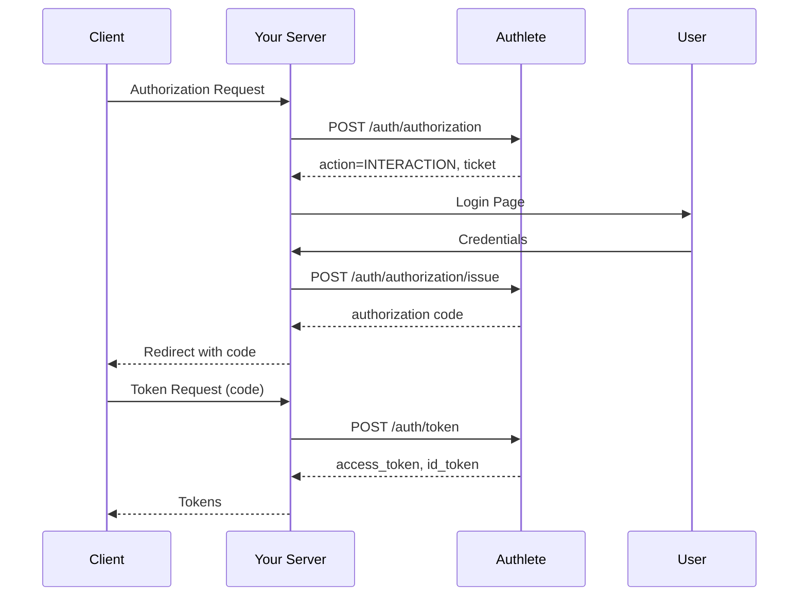

# Authlete API 3.0.16

Welcome to the **Authlete API**. Authlete is an API-first authorization and authentication platform that enables you to build OAuth 2.0 and OpenID Connect servers, as well as verifiable credential issuers.

## API Overview

The Authlete API is organized into two main categories:

### Management APIs
Configure and manage your authorization infrastructure:
- **Services**: Create and configure authorization servers
- **Clients**: Register and manage OAuth 2.0/OIDC client applications
- **Policies**: Define authorization policies and access control rules

### Runtime APIs
Implement OAuth 2.0 and OpenID Connect flows:
- **Authorization**: Handle authorization requests and consent
- **Token**: Issue and manage access tokens, refresh tokens, and ID tokens
- **Introspection & Revocation**: Validate and revoke tokens
- **UserInfo**: Serve user information endpoints
- **Dynamic Client Registration**: Support RFC 7591 client registration

## Authentication

All Authlete API endpoints require Bearer token authentication. You must include your access token in the `Authorization` header of every request:

```http
Authorization: Bearer YOUR_ACCESS_TOKEN
```

### Token Types

Authlete supports two types of access tokens:

#### Service Access Token
Scoped to a **single service** (authorization server instance).

**Use when:**
- Automating service-level configuration
- Building authorization server runtime endpoints
- Managing clients within a specific service

**How to get one:**
1. Log in to the Authlete Console
2. Navigate to your service
3. Go to **Settings** → **Access Tokens**
4. Click **Create Token**
5. Copy the generated token

The token will have service-level permissions for the selected service.

#### Organization Token
Scoped to your **entire organization** with permissions across all services.

**Use when:**
- Managing multiple services programmatically
- Performing org-wide automation
- Building control plane tooling

**How to get one:**
1. Log in to the Authlete Console
2. Navigate to **Organization Settings**
3. Go to **Access Tokens**
4. Click **Create Token**
5. Copy the generated token

### Token Security

⚠️ **Important Security Notes:**

- **Treat tokens like passwords**: Never commit them to version control or expose them in client-side code
- **Rotate regularly**: Generate new tokens periodically and revoke old ones
- **Use environment variables**: Store tokens in environment variables or secure secret management systems
- **Scope appropriately**: Request only the permissions your application needs
- **Revoke unused tokens**: Delete tokens you're no longer using from the console

### Testing Your Token

Verify your token works with a simple API call:

```bash
curl -X GET https://api.authlete.com/api/service/get/list \
  -H "Authorization: Bearer YOUR_ACCESS_TOKEN"
```

A successful response confirms your token is valid and has the correct permissions.

## Base URLs

Authlete operates globally with regional API clusters. Choose the region that best meets your data residency requirements:

| Region | Base URL |
|--------|----------|
| 🇺🇸 United States | `https://us.authlete.com` |
| 🇯🇵 Japan | `https://jp.authlete.com` |
| 🇪🇺 Europe | `https://eu.authlete.com` |
| 🇧🇷 Brazil | `https://br.authlete.com` |

Replace `https://api.authlete.com` in examples with your regional base URL.

## Quick Start

### 1. Get Your Access Token

Follow the steps in the [Authentication](#authentication) section to create a Service or Organization token.

### 2. Make Your First API Call

List your services:

```bash
curl -X GET https://us.authlete.com/api/service/get/list \
  -H "Authorization: Bearer YOUR_ACCESS_TOKEN" \
  -H "Content-Type: application/json"
```

### 3. Create a Client Application

Register a new OAuth 2.0 client:

```bash
curl -X POST https://us.authlete.com/api/{serviceId}/client/create \
  -H "Authorization: Bearer YOUR_ACCESS_TOKEN" \
  -H "Content-Type: application/json" \
  -d '{
    "clientName": "My Application",
    "redirectUris": ["https://myapp.example.com/callback"],
    "grantTypes": ["AUTHORIZATION_CODE", "REFRESH_TOKEN"],
    "responseTypes": ["CODE"]
  }'
```

### 4. Process an Authorization Request

When your authorization server receives an authorization request, forward it to Authlete:

```bash
curl -X POST https://us.authlete.com/api/{serviceId}/auth/authorization \
  -H "Authorization: Bearer YOUR_ACCESS_TOKEN" \
  -H "Content-Type: application/json" \
  -d '{
    "parameters": "response_type=code&client_id=CLIENT_ID&redirect_uri=https://myapp.example.com/callback&scope=openid profile"
  }'
```

Authlete validates the request and returns an action for your authorization server to take.

## API Patterns

### Request/Response Flow

Most Authlete APIs follow this pattern:

1. **Your server receives a request** from a client application
2. **Forward to Authlete** with request parameters
3. **Authlete validates** and returns an `action` field
4. **Your server responds** to the client based on the action

Example response structure:

```json
{
  "resultCode": "A004001",
  "resultMessage": "[A004001] The authorization request is valid.",
  "action": "INTERACTION",
  "ticket": "TICKET_VALUE",
  "client": {
    "clientId": 1234567890,
    "clientName": "My Application"
  }
}
```

### Action-Based Responses

The `action` field tells you what to do next:

- **`OK`**: Success - return the provided `responseContent` to the client
- **`INTERACTION`**: User authentication required - show login page
- **`NO_INTERACTION`**: Issue token immediately (e.g., refresh token grant)
- **`BAD_REQUEST`**: Invalid request - return 400 error with `responseContent`
- **`UNAUTHORIZED`**: Authentication failed - return 401 error
- **`INTERNAL_SERVER_ERROR`**: Server error - return 500 error

### Tickets

Many Authlete APIs use **tickets** as correlation identifiers:

1. Initial API call returns a `ticket`
2. After completing your processing (e.g., user authentication), call a follow-up API with the ticket
3. Authlete uses the ticket to retrieve the original context

Example flow:
```
/auth/authorization → returns ticket → [user authenticates] → /auth/authorization/issue (with ticket)
```

## Common Workflows

### Authorization Code Flow



### Token Introspection

```bash
curl -X POST https://us.authlete.com/api/{serviceId}/auth/introspection \
  -H "Authorization: Bearer YOUR_ACCESS_TOKEN" \
  -H "Content-Type: application/json" \
  -d '{
    "token": "ACCESS_TOKEN_TO_VALIDATE"
  }'
```

Response indicates if the token is active and includes metadata:

```json
{
  "action": "OK",
  "active": true,
  "clientId": 1234567890,
  "subject": "user123",
  "scopes": ["openid", "profile"],
  "expiresAt": 1699999999000
}
```

## Error Handling

All Authlete API responses include:

- **`resultCode`**: Machine-readable error code (e.g., `A004201`)
- **`resultMessage`**: Human-readable error description
- **`action`**: Recommended action to take

Example error response:

```json
{
  "resultCode": "A001202",
  "resultMessage": "[A001202] Authorization header is missing.",
  "action": "INTERNAL_SERVER_ERROR"
}
```

### Common Error Codes

| Code | Meaning |
|------|---------|
| `A001201` | TLS required - use HTTPS |
| `A001202` | Missing Authorization header |
| `A001203` | Invalid access token |
| `A001215` | Client is locked |
| `A004101` | Invalid authorization request parameters |

## Rate Limits

Authlete applies rate limits per access token:

- **Default**: 100 requests per second
- **Burst**: Up to 200 requests per second for short periods

Rate limit headers are included in responses:

```
X-RateLimit-Limit: 100
X-RateLimit-Remaining: 95
X-RateLimit-Reset: 1699999999
```

If you exceed the limit, you'll receive a `429 Too Many Requests` response.

## SDK & Tools

### Official SDKs

- [TypeScript/JavaScript SDK](https://github.com/authlete/authlete-typescript-sdk)
- [Java SDK](https://github.com/authlete/authlete-java-common)
- [.NET SDK](https://github.com/authlete/authlete-csharp)

### Reference Implementations

- [Node.js Authorization Server](https://github.com/authlete/authlete-nodejs-as)
- [Spring Boot Authorization Server](https://github.com/authlete/spring-oauth-server)

### Tools

- [Authlete Console](https://console.authlete.com) - Web-based management UI
- [OpenAPI Specification](https://github.com/authlete/openapi) - Machine-readable API definition

## Support & Resources

### Documentation

- [Getting Started Guide](https://www.authlete.com/developers/getting_started/)
- [Tutorial: Sign-Up to First API Request](https://www.authlete.com/developers/tutorial/signup/)
- [API Reference](https://docs.authlete.com/)

### Getting Help

- **Email**: [support@authlete.com](mailto:support@authlete.com)
- **Contact Form**: [authlete.com/contact](https://www.authlete.com/contact/)
- **GitHub Issues**: Report bugs in respective SDK repositories

### Service Status

- [Status Page](https://status.authlete.com/) - Real-time service health and incident updates

## Versioning

This documentation describes **Authlete API version 3.0.16**.

The API uses semantic versioning:
- **Major version** (3.x.x): Breaking changes
- **Minor version** (x.0.x): New features, backwards compatible
- **Patch version** (x.x.16): Bug fixes, backwards compatible

Pin your integration to a specific version to ensure stability. New versions are announced via email and the [changelog](https://docs.authlete.com/changelog/).

## Terms & Compliance

- [Terms of Service](https://www.authlete.com/terms/)
- [Privacy Policy](https://www.authlete.com/privacy/)
- [Security](https://www.authlete.com/security/)

Authlete is compliant with:
- OAuth 2.0 (RFC 6749)
- OpenID Connect Core 1.0
- FAPI 1.0 and 2.0
- UK Open Banking

---

**License**: This API specification is licensed under [Apache 2.0](https://www.apache.org/licenses/LICENSE-2.0.html).

